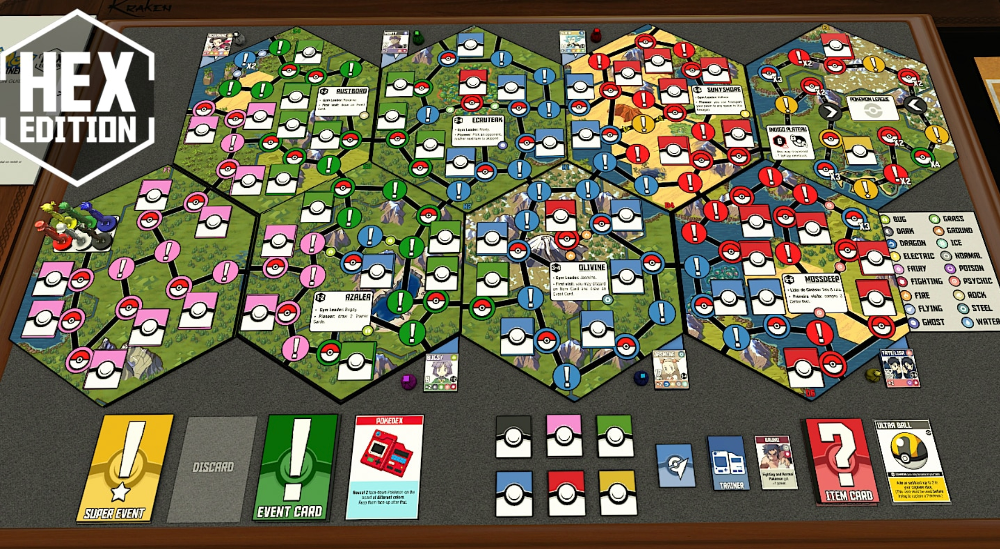
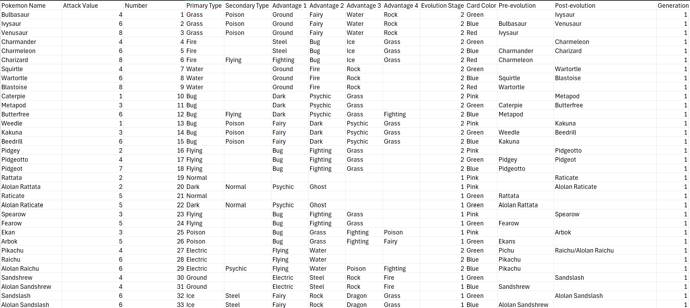
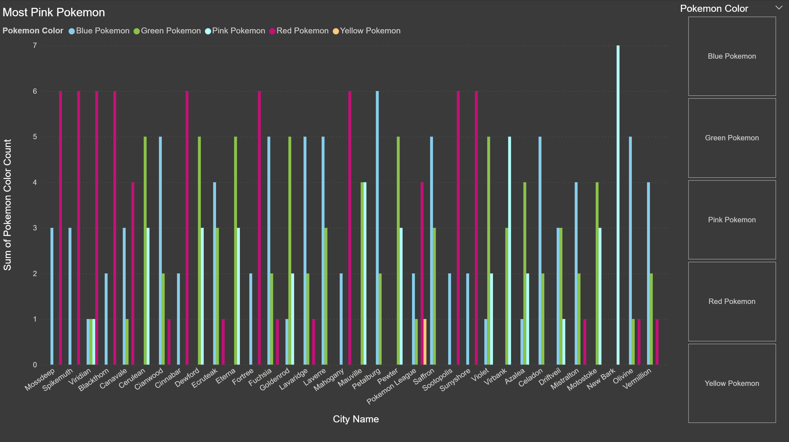
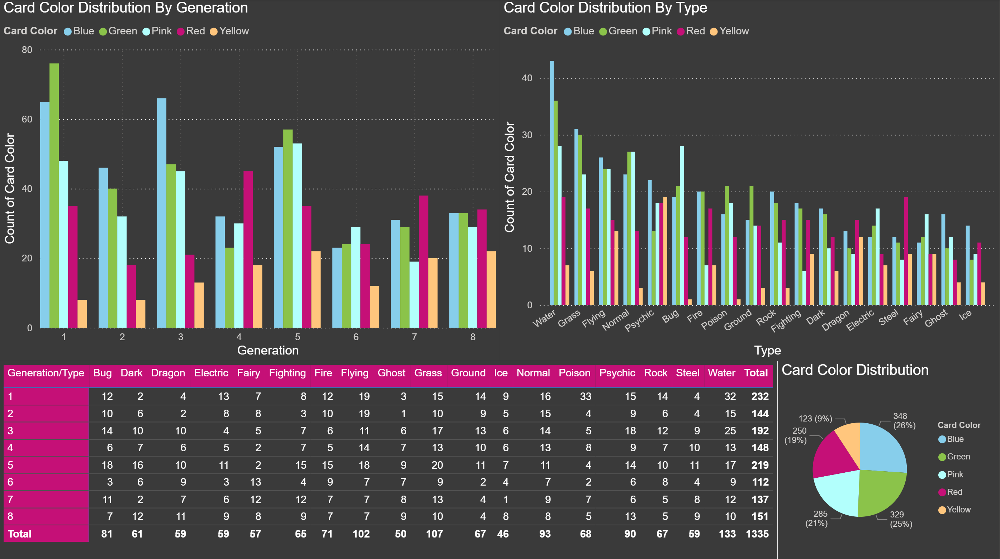
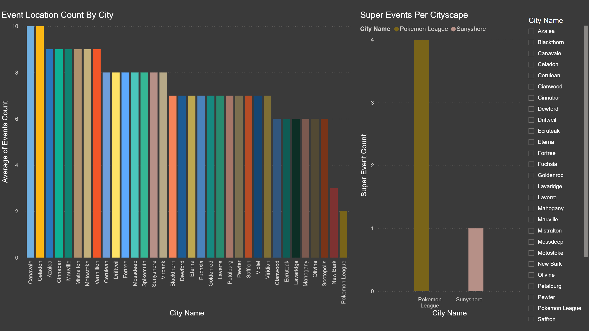
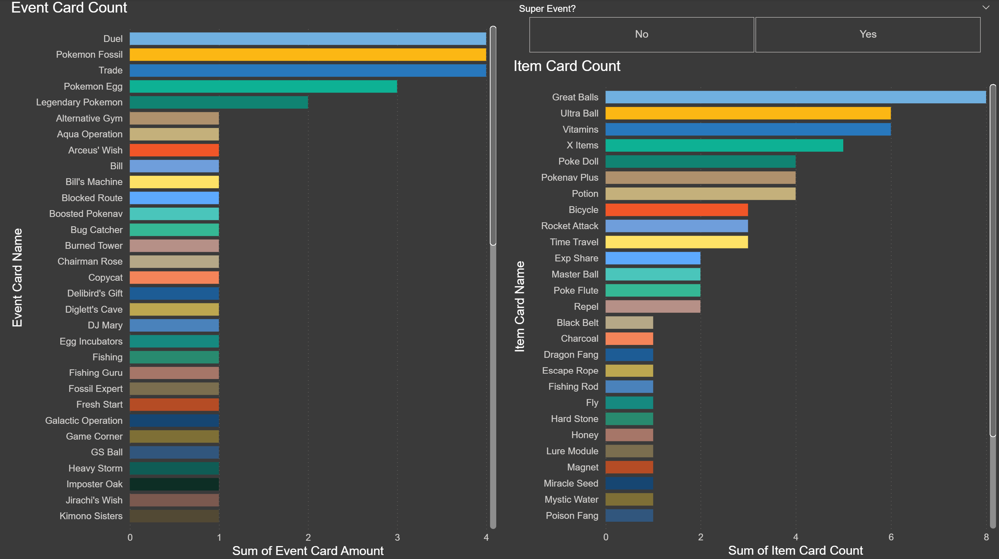
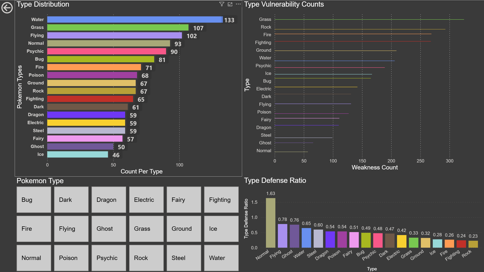
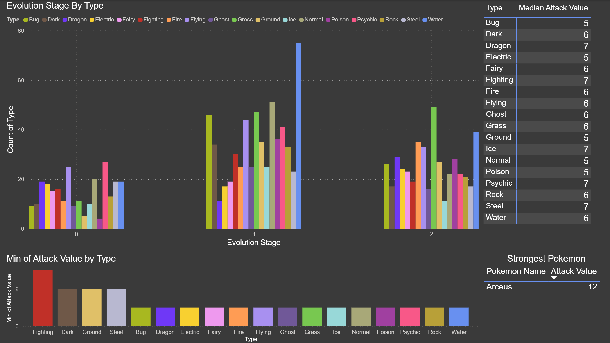
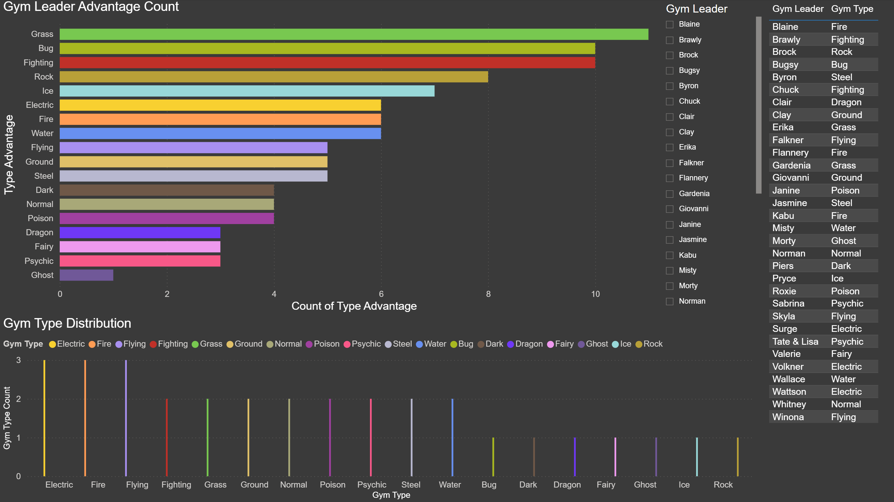
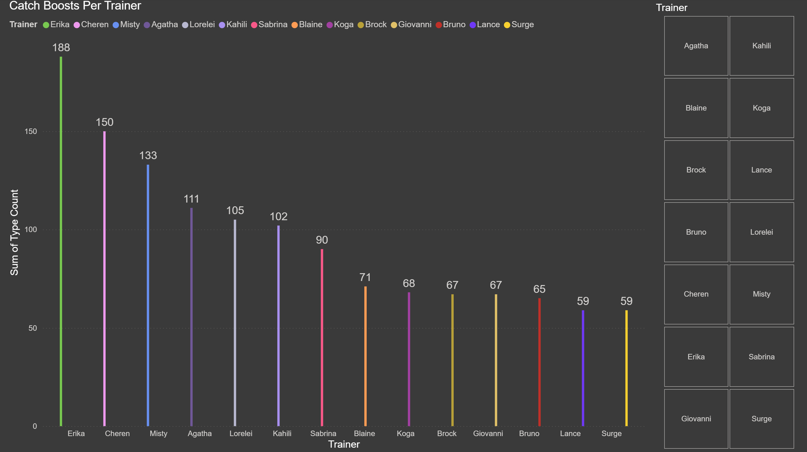

# Pokemon Master Trainer: Hex Edition Power BI Report
This a Power BI Report for the board game Pokémon Master Trainer: HEX Edition which is a board game with 912 pokemon.
Data was gathered through the use of the Tabletop Simulator video game, manually shuffling through all Pokemon card and cityscapes, and recording the data in an Excel file.

---

## Data Preview

---
## Data Analysis

### Pokémon Card Color Distribution By City
The chart below shows how many Pokémon catching zones of particular colors are in each cityscape available in the board game.

### Pokémon Card Color Distribution By Type and Generation
The chart below shows how many Pokémon of each color are from each Pokémon type and Pokémon generation.

### Events Per Cityscape
The chart below shows how many events spots are located in each cityscape.

### Events and Items
The chart below shows the distribution count of all events and items in the board game.

### Typing Distribution
The chart below shows the count of each Pokémon per type, how much each type is weak to other Pokémon, and a ratio of Pokémon Count to Weaknesses.

The chart below shows how many evolution stages are associated with each type, the median attack value of each type, the minimum attack value of each type, and the strongest Pokémon in the game.

### Gym Leader Info
The chart below shows the count of what types have weaknesses against all gym leaders, the distribution of gym leaders by type, and the gym leaders' names and corresponding type.

### Catch Boosts
This chart highlights the volume of Pokémon per type that receive a Catch Rate Modifier when the player holds a matching Trainer Card.

---

## Game Rules

Each Pokémon has an associated card color of: Pink, Green, Blue, Red, and Yellow with Yellow representing legendary Pokémon The cards have their attack value listed, how many evolution stages they have (e.g. a 2-stage evolution means it evolves 2 times from its base form), the card colors of its pre-evolutions and post-evolutions, their primary type and potentially secondary type, and up to 4 Pokémon Types that card is strong against. You also a dice value that you have to roll to be able to catch that Pokémon. There are 8 generations of Pokémon to choose between using. If you have a pre-evolution of a card, that card gets +@ to its attack value. Some cards like Kangaskhan don't have pre-evolutions so they can't receive bonuses and therefore it stays at an 8 unless a +1 token is added to it (One received upon obtaining your 6th badge and another for entering the Pokémon League). Some Pokémon have 1-stage evolutions like Primeape. If you have both Mankey and Primeape, Primeape gains a +2 to increase its attack from 5 to a 7. @-stage evolutions also exist. All starters are 2-stage evolutions and they get a +2 for each pre-evolution you own. If you own Charizard and Charmander, Charizard receives a +2 to make it have an attack value of 10, but if you own Charizard, Charmeleon, and Charmander, Charizard goes from an attack value of 8 to a value of 12.

The board consists of the default cityscapes of New Bark and the Pokémon League, and 6 cityscapes per game you can choose between with differing Gym Leaders (There are 34 cities total that are restricted on their location on the board based on how strong the gym leader), Pokémon colors you can catch (If you land on a pink Pokémon spot, you flip that face-down pink Pokémon card face-up and try to catch it by rolling ), and event locations (If you land on one you draw an event card from the pile and activate it). Some cities also have a "Pioneer" bonus that the first person to land there receives as a reward.

Gym leaders have an attack value listed on their card (e.g. Brock has an attack value of 8). They also have up to 4 types they have advantages against. To challenge a gym you must take the attack value of the Pokémon you're using and add up any type advantages or disadvantages you have. Then you roll a single die and add that value to your Pokémon's attack value. There are also items cards to help in battles offering +2 to +4 attack boosts and they must be discarded after use. If your total ties with or exceeds the gym leader's attack value then you receive their Pokémon badge. Most gyms are single battles only meaning you can only use one Pokémon, but some are double battles so you can use two Pokémon and add their attack values (e.g. Wattson of Mauville has an attack value of 11 and is a double battle. If you both Pokémon's attack value summed matches or exceeds that 11, you win that battle.)

Upon receiving your 6th badge you can enter the Pokémon League where you'll enter the Elite Four after going around the Pokémon League at least once. There are 23 different Elite Four members and you draw your opponent randomly. All battles here are double battles and they have 2 Pokémon as well. Each of your Pokémon must battle one of theirs and you must defeat both to win. You can't use one Pokémon for both. Unlike gyms, the Elite Four get to roll a die to add to their attack value and their boost is listed on their card based on the die value rolled. Each battle is done individually and one dice roll only counts for one Pokémon. You must also exceed the Elite Four's attack value to beat them. Tying means that you lose the battle. (e.g. Drake has a Flygon and a Salamence. His Flygon has an attack value of 10 and is Dragon/Ground typing. It is strong against Water, Fire, Grass, and Electric. His Salamence has an attack value of 11, has a Dragon/Flying typing, and is strong against Water, Fire, Grass, and Electric as well. If Drake rolls a 2 or 3 on his die, he gets +2 to his attack. If he rolls a 3 or 4, he gets +3. A dice roll of 5 gives him +4, and a dice roll of 6 gives him +5. If he rolls a 6 on his Flygon you need a 15 to beat his Flygon.)

Event cards consist of events like drawing a certain Pokémon color, drawing a certain amount of items, having to duel another player for a reward for whoever wins, and other effects. Some item cards can negate event cards like Poke Flute which allows you to cancel any event and make whoever activated that card to discard it and draw another. There is also a Poke Doll which allows you to negate almost any effect that affects you. Event cards and item cards list whether a Poke Doll can negate them.

Item cards consist of cards that add attack boosts for your Pokémon, the ability to steal a card from another player, Poke Balls to make catches easier, and other effects. Poke Balls increase your dice range by 1. So if you're trying to catch a Dragonite which requires a dice roll of 5 to catch, you can use a Poke Ball so if you roll 4-6 you catch Dragonite. Ultra Balls increase your range by 2 so a 3-6 works for Dragonite, and a Master Ball increases your range by 4 so you get Dragonite no matter what the result of your dice roll is. The only Pokémon that Master Ball isn't guaranteed to catch are legendaries (Yellow cards). It increases their range to 2-6. Even if you have a Master Ball and you roll a 1 on a legendary, you fail to catch it. You are limited to 6 items in your hand unless you have a certain trainer card.

Finally, each player gets a trainer card. Some trainer cards have 1 to 2 types listed on their card and for these types they give a +1 to their attack value and make it easier to catch those types. A Charizard with both pre-evolutions and the trainer card Blaine, who gives a +1 to Fire types, becomes a 13. These trainers make it easier to catch Pokémon of that type by allowing you to add or subtract from your dice roll similar to a Poke Ball. However, you don't have to discard your trainer to use these boosts and they keep working until you willingly discard your trainer or someone else makes you. Other trainers give you boosts like +1 to all your Pokémon at the cost of having to reduce your hand size to a max of 3 with Alder, increase your hand size to 8 with Backpacker, optionally move 1-2 spaces each turn with Hiker, draw an item card whenever you roll a 1 with Silver, draw an item card whenever you catch a Pokémon with Blue, and other effects.
